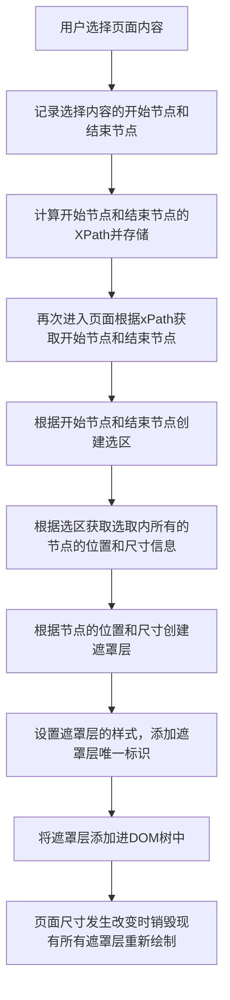
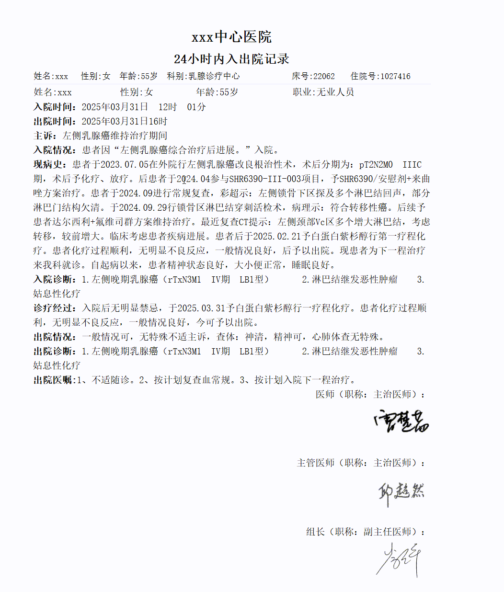

# 需求背景
质控科老师期望能够在病历上通过鼠标选中一段内容，然后对这段内容进行点评。
要求选中的内容需要高亮显示，而且下次登录进来时高亮效果要保留。

# 技术选型
根据上面的需求，可以归纳出以下技术性的要点。
- 记录用户在病历上的选中区域
- 保存选中区域在病历上的位置信息
- 高亮显示病历上选中区域

常见的高亮方案是用户选中病历文书中的某一部分时，将这一部分内容使用一个标签进行包裹，然后对标签内容进行CSS样式处理以达到高亮效果。但是，病历作为敏感的医疗文档，不能被篡改。这就要求在实现高亮的效果时，不能修改病历。该方案被否定。

本文选择的技术方案是使用遮罩层的路线。当用户选择一段内容时，记录这段内容在病历上的位置和尺寸，然后创建一个罩子，罩在选中的内容上面，这个罩子是空的span标签，但是有尺寸，有背景色。最终的效果是选中的内容具有高亮的背景色。

<!-- 遮罩层的技术的核心难点
1. 计算选区开始节点和结束节点在HTML文档中的XPATH路径信息。
2. 根据存储的节点XPATH路径信息逆向获取节点。
3. 根据开始节点和结束节点还原选区。 -->

# 架构设计
<center>



</center>


# 核心函数

## 获取用户的选区
```js
const sel = window.getSelection();
const range = sel.getRangeAt(0);
```

## 获取选区的位置
```js
  const startContainer = range.startContainer;
  const endContainer = range.endContainer;

  // 获取节点的XPath
  const startXPath = getXPathByNode(startContainer);
  const endXPath = getXPathByNode(endContainer);

  // 获取节点的偏移量
  const startOffset = range.startOffset;
  const endOffset = range.endOffset;

    // 记录是否为文本节点
  const startIsText = startContainer.nodeType === Node.TEXT_NODE;
  const endIsText = endContainer.nodeType === Node.TEXT_NODE;

  // 记录文本内容作为备用定位方式
  const textContent = range.toString();
```
<strong>重点需要注意的是</strong>，选区可能是纯文本区域，也可能是跨越多个元素的区域。对文本节点和元素节点的处理是有差别的，所以需要标记开始节点和结束节点的类型。

如果开始节点是元素节点，startOffset 表示的含义是从第一个节点开始，偏移若干个节点。

如果开始节点是文本节点，startOffset 表示的含义是从第一个字符开始，偏移若干个字符。

## 计算节点的XPATH路径

``` js
// 获取元素的XPath
export const getXPathByNode = (element: Node) => {
  if (element.nodeType === Node.TEXT_NODE) {
    // 对于文本节点，返回父元素的XPath并标记为文本节点
    return getElementXPath(element.parentNode as Element) + '/text()';
  }
  if (element.nodeType === Node.ELEMENT_NODE) {
    return getElementXPath(element as Element);
  }
  return '';
};
```
文本节点包含在元素节点中，为了方便处理，统一将文本节点转化成元素节点处理。

```js
// 获取元素节点的XPath
export const getElementXPath = (element: Element): string => {
  if (!element || element.nodeType !== Node.ELEMENT_NODE) {
    return '';
  }
  if (element.id) {
    return `//*[@id="${element.id}"]`;
  }
  const paths: string[] = [];
  let currentElement: Element | null = element;
  while (currentElement && currentElement.nodeType === Node.ELEMENT_NODE) {
    let index = 0;
    // 计算在同级元素中的位置
    for (let sibling = currentElement.previousSibling; sibling; sibling = sibling.previousSibling) {
      if (sibling.nodeType === Node.ELEMENT_NODE && sibling.nodeName === currentElement.nodeName) {
        index++;
      }
    }
    const tagName = currentElement.nodeName;
    const pathIndex = index > 0 ? `[${index + 1}]` : '';
    paths.unshift(`${tagName}${pathIndex}`);
    currentElement = currentElement.parentElement;
  }

  return paths.length ? `/${paths.join('/')}` : '';
};
```

## 根据XPATH路径还原节点

```js
// 通过XPath获取节点的辅助函数
export const getNodeByXPath = (xpath: string) => {
  try {
    return document.evaluate(
      xpath,
      document,
      null,
      XPathResult.FIRST_ORDERED_NODE_TYPE,
      null
    ).singleNodeValue;
  } catch (error) {
    console.error('XPath解析失败:', error);
    return null;
  }
};
```

## 根据开始节点和结束节点还原选区

```js

interface Anchor {
  startXPath: string,
  endXPath: string,
  startOffset: number,
  endOffset: number,
  textContent: string,
  startIsText: boolean,
  endIsText: boolean,
}

// 根据存储的定位信息找到当前文本位置
export const getRangeByAnchor = (anchor: Anchor) => {
  try {
    let startNode: Node | null = null;
    let endNode: Node | null = null;

    // 解析起始节点
    if (anchor.startIsText) {
      // 如果是文本节点，获取父元素然后选择其文本子节点
      const elementPath = anchor.startXPath.replace(/\/text\(\)$/, '');
      const parentElement = getNodeByXPath(elementPath) as Element;
      if (parentElement) {
        startNode = parentElement.childNodes[0]; // 获取第一个文本节点
      }
    } else {
      startNode = getNodeByXPath(anchor.startXPath);
    }

    // 解析结束节点
    if (anchor.endIsText) {
      const elementPath = anchor.endXPath.replace(/\/text\(\)$/, '');
      const parentElement = getNodeByXPath(elementPath) as Element;
      if (parentElement) {
        endNode = parentElement.childNodes[0]; // 获取第一个文本节点
      }
    } else {
      endNode = getNodeByXPath(anchor.endXPath);
    }

    if (!startNode || !endNode) {
      // fallback: 使用文本内容搜索
      console.error('使用文本内容搜索');
      return getRangeByContent(anchor.textContent);
    }

    const range = document.createRange();
    range.setStart(startNode, anchor.startOffset);
    range.setEnd(endNode, anchor.endOffset);
    return range;
  } catch (error) {
    console.error(error);
    return getRangeByContent(anchor.textContent);
  }
};
```

# 功能演示


# 完整代码